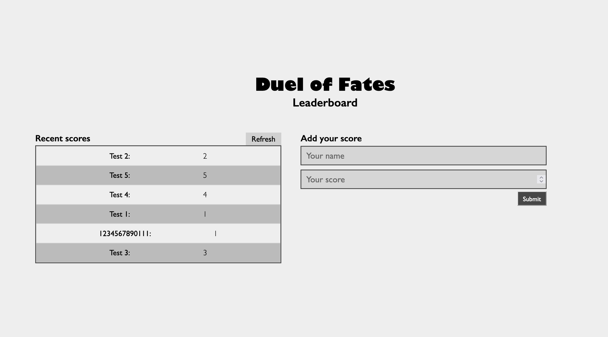

  

# To Do List ⚙️
> This is a leaderboard App to practice Javascript, API implementation and Webpack deployment.
# Live Demo ⚙️
- GitHub Pages: [DEMO](https://raminka13.github.io/leaderboard-app/dist/)

## Tech ⌘⇧
- **HTML & CSS best practices:** Correct use of tags, elements, properties and syntax.
- **Gitflow:**  Correct use of Branches for deployment and features development.
- **Webpack:**  Source development for production bundling.
- **Linters Check:** Local and Pull Request Github workflows to check for stylistic errors, bugs and syntax errors in code.

## Author ✍🏼
👤 **Raul A Ospina** 🧑🏻‍💻
- GitHub: [@raminka13](https://github.com/raminka13)
- Twitter: [@raminka13](https://twitter.com/raminka13)
- LinkedIn: [Raul Ospina](http://linkedin.com/in/raul-ospina-83232614)

## Project Milestones
- **Milestone 0 - Project setup (4h)** ✅
- **Milestone 1 - Hit the API (4h)** 
- **Milestone 2 - App styling (3h)** 

## Show your support 🦾
- Give a ⭐️ if you like this project!

## License 📝 
- This project is [MIT](./MIT.md) licensed.
